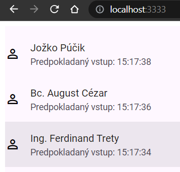

## Application Skeleton

---

> Info: >
Template for a pre-created container ([Details here](../99.Problems-Resolutions/01.development-containers.md)):  
`registry-1.docker.io/milung/wac-ufe-010`

---

In this chapter, we will create the basic skeleton of our application. While its functionality will be limited, it will allow us to set up the project environment with essential automation, enabling us to focus on the development and evolution of our application. Automation tools will handle repetitive steps related to integration and deployment.

For this application, we will utilize the [Stencil JS][stencil] library to create web components representing our micro front end. For a more in-depth understanding of the library, we recommend studying its documentation, which is relatively short and easy to comprehend. If you wish to familiarize yourself with web component technology, check out the [materials here][webc].

1. Open Visual Studio Code, and within it, open a new terminal (menu `Terminal->New Terminal`).

2. In the command line, navigate to the `${WAC_ROOT}` directory designated for exercises in this course.

3. Execute the command to create a new project based on the StencilJS library:

```ps
npm init stencil
```

>info:> When executing this command, the missing libraries needed to create the project will be installed.

Choose `component` as the project type and `ambulance-ufe` as the name. StencilJS allows you to create a standalone SPA/PWA application, but in our case, we are interested only in creating a set of web components to be used in a common application. From a practical standpoint, the main difference lies in creating the final package for deploying our application/web component.

After the command completes, a new folder `ambulance-ufe` is created in the working directory, containing the application skeleton. In this folder, you will find the `package.json` file, which describes basic project attributes such as its name, author, version, and more. It also includes a list of `dependencies` libraries needed during the deployment of the application and a list of `devDependencies` libraries needed during the development of the application. Another important section in this file is the `scripts` object, describing commonly used commands in development. These commands can be executed using the `npm run <script-name>` command, and custom commands can be added as needed by the development team.

Another crucial file is `stencil.config.ts`. This file describes the project settings used during compilation, development, and generation of the project's components. During initialization, it primarily contains the basic configuration of options - `outputTargets` generated during the compilation of the project.

The other created directories include the source file directory `src` and the `node_modules` directory containing external libraries/modules on which our application depends. It is necessary to exclude the `node_modules` directory from version control, meaning to add it to the `.gitignore` file.

4. The program skeleton created in this way includes a functional `Hello world` component. Navigate to the `${WAC_ROOT}/ambulance-ufe` directory and enter the following commands:

```ps
npm install
npm run start
```

The first command installs the libraries on which our project depends, and the second command starts the application. After a while, you can see the output of this application in the browser.


>build_circle:> If you encounter an error related to `Puppeteer` during the execution of the command, follow the instructions in the chapter [Problem Resolution](../99.Problems-Resolutions/02.puppeteer.md). You can temporarily fix this issue by setting the environment variable `PUPPETEER_SKIP_CHROMIUM_DOWNLOAD` to the value `true`:
>
> ```ps
> $env:PUPPETEER_SKIP_CHROMIUM_DOWNLOAD="true"
> ```

5. Now, let's create the first web component that will display a list of patients waiting for examination. The visual design is based on the [Material Design](https://material.io/) style.

Navigate to the `ambulance-ufe` application folder and install the web component libraries for Material Design:

```ps
npm install -s @material/web
```

The option `-s` means that the library will be installed as a dependency of the application, indicating it will be part of the package deployed to the server. An alternative option `-D` would mean that the library is only needed during development but not required during the application deployment. This differentiation is crucial, especially when creating a package of web components and publishing it in the [npmjs.com](https://www.npmjs.com/) registry. When using such a package in another project, only the libraries added as necessary for the application's runtime will be automatically installed, not the ones added only for the development of our `ambulance-ufe` package. More information on publishing packages can be found in the [documentation](https://stenciljs.com/docs/publishing).

Subsequently, create a new web component using the command:

```ps
npm run generate
```

If prompted to enter the component name, choose the name `<pfx>-ambulance-wl-list`. Replace `<pfx>` with your initials or another identifier that distinguishes your web components from others in the exercise.

>info:> Throughout the text, we will use the placeholder `<pfx>` as an identification that must be consistently replaced. This prefix is crucial for deploying the web component into a shared cluster, where conflicts could lead to unpredictable behavior.

Confirm the choice and also answer the following question regarding additional files for the created web component. Now you have created a new web component in the directory `${WAC_ROOT}/ambulance-ufe/src/components/<pfx>-ambulance-wl-list`.


6. Open the file `${WAC_ROOT}/ambulance-ufe/src/components/<pfx>-ambulance-wl-list/<pfx>-ambulance-wl-list.tsx` and add the method `getWaitingPatientsAsync` and the attribute `waitingPatients`:
  
```tsx
import { Component, Host, h } from '@stencil/core';

@Component({
  tag: '<pfx>-ambulance-wl-list',
  styleUrl: '<pfx>-ambulance-wl-list.css',
  shadow: true,
})
export class <Pfx>AmbulanceWlList {

  waitingPatients: any[]; @_add_@
  @_add_@
  private async getWaitingPatientsAsync(){  @_add_@
    return await Promise.resolve(  @_add_@
      [{  @_add_@
          name: 'Jožko Púčik',  @_add_@
          patientId: '10001',  @_add_@
          since: new Date(Date.now() - 10 * 60).toISOString(),  @_add_@
          estimatedStart: new Date(Date.now() + 65 * 60).toISOString(),  @_add_@
          estimatedDurationMinutes: 15,  @_add_@
          condition: 'Kontrola'  @_add_@
      }, {  @_add_@
          name: 'Bc. August Cézar',  @_add_@
          patientId: '10096',  @_add_@
          since: new Date(Date.now() - 30 * 60).toISOString(),  @_add_@
          estimatedStart: new Date(Date.now() + 30 * 60).toISOString(),  @_add_@
          estimatedDurationMinutes: 20,  @_add_@
          condition: 'Teploty'  @_add_@
      }, {  @_add_@
          name: 'Ing. Ferdinand Trety',  @_add_@
          patientId: '10028',  @_add_@
          since: new Date(Date.now() - 72 * 60).toISOString(),  @_add_@
          estimatedStart: new Date(Date.now() + 5 * 60).toISOString(),  @_add_@
          estimatedDurationMinutes: 15,  @_add_@
          condition: 'Bolesti hrdla'  @_add_@
      }]  @_add_@
    );  @_add_@
  }  @_add_@
  
  render() {
    ...
  }
}
```

The method `getWaitingPatientsAsync()` is currently implemented as a placeholder for accessing the REST API of a microservice and returns a static list of waiting patients. We will adjust the API access later. It's important to note that this method will be an asynchronous call to a remote service, so we are already working with the assumption that this method is asynchronous and returns a [Promise] object (or a `then-able object`).

Next, add the method `componentWillLoad()`, which will be called before the initial rendering of the web component. In this method, call the `getWaitingPatientsAsync()` method and assign the result to the `waitingPatients` attribute. This ensures that the web component is initialized with the current list of waiting patients.

```tsx
import { Component, Host, h } from '@stencil/core';

@Component({
  tag: '<pfx>-ambulance-wl-list',
  styleUrl: '<pfx>-ambulance-wl-list.css',
  shadow: true,
})
export class <Pfx>AmbulanceWlList {

  waitingPatients: any[];

  private async getWaitingPatientsAsync(){
    ...
  }

  async componentWillLoad() {@_add_@
    this.waitingPatients = await this.getWaitingPatientsAsync();@_add_@
  }@_add_@
  
  render() {
    ...
  }
}
```

Subsequently, modify the content of the `render()` method, add the necessary dependencies on components from the `@material/web` library, and include the helper function `isoDateToLocale()`. This function converts the ISO date format to the local date and time format and will be used when displaying the patient's entry time into the waiting room.

```tsx
import { Component, Host, h } from '@stencil/core';
import '@material/web/list/list'  @_add_@
import '@material/web/list/list-item'   @_add_@
import '@material/web/icon/icon' @_add_@

@Component({
  tag: '<pfx>-ambulance-wl-list',
  styleUrl: '<pfx>-ambulance-wl-list.css',
  shadow: true,
})
export class <Pfx>AmbulanceWlList {
  ....

  render() {
    return (
      <Host>
      <slot></slot> @_remove_@

        <md-list>   @_add_@
          {this.waitingPatients.map(patient =>    @_add_@
            <md-list-item>   @_add_@
              <div slot="headline">{patient.name}</div>   @_add_@
              <div slot="supporting-text">{"Predpokladaný vstup: " + this.isoDateToLocale(patient.estimatedStart)}</div>   @_add_@
                <md-icon slot="start">person</md-icon>   @_add_@
            </md-list-item>   @_add_@
          )}   @_add_@
        </md-list>   @_add_@
      </Host>
    );
  }

  private isoDateToLocale(iso:string) {@_add_@
    if(!iso) return '';@_add_@
    return new Date(Date.parse(iso)).toLocaleTimeString()@_add_@
  }@_add_@
}
```

The `render()` method is used to render the content of the web component. For this, we use the [JSX][jsx] syntax, which allows embedding HTML code directly into the web component code. The `<Host>` element is a special element that informs the [Stencil JS](https://stenciljs.com/docs/compiler-api) compiler that the following content is within the hosting element. Elements like `md-list`, `md-icon`, and others with the prefix `md-` are from the [Material Design Web Components][md-webc] library.

Pay attention to the special attribute [`slot`](https://developer.mozilla.org/en-US/docs/Web/HTML/Element/slot). The slot name is determined by the web components themselves and informs them that an element with this attribute is intended for the respective slot. For example, `slot="start"` specifies that the `md-icon` element should be displayed in the position designated for the list item's graphic identifier.

The `componentWillLoad()` and `render()` methods are [lifecycle methods](https://stenciljs.com/docs/component-lifecycle) of the web component in the [Stencil JS][stencil] library. These methods (except `render()`) can return a `Promise` object and be executed asynchronously. In our case, in the `componentWillLoad()` method, we load and store the list of patients waiting in the waiting room.

This is how we have defined our first web component.

7. To efficiently use the design style of [Material Design], we need to load the corresponding fonts into the application. Modify the file `.../ambulance-ufe/src/index.html` and add the following lines to the HTML document's header:

```html
<!DOCTYPE html>
<html dir="ltr" lang="en">
    <head>
      <meta charset="utf-8" />
      <meta name="viewport" content="width=device-width, initial-scale=1.0, minimum-scale=1.0, maximum-scale=5.0" />
      <link href="https://fonts.googleapis.com/css?family=Roboto:300,400,500" rel="stylesheet"> @_add_@
      <link href="https://fonts.googleapis.com/css2?family=Material+Symbols+Outlined" rel="stylesheet" /> @_add_@
      <title>Ambulance Waiting List Tester</title>
      <script type="module" src="/build/ambulance-ufe.esm.js"></script>
      <script nomodule src="/build/ambulance-ufe.js"></script>
    </head>
    
    <body style="font-family: 'Roboto'; "> @_important_@
      ...
    </body>
</html>
```

In addition to loading the font for web icons and the font for Material Design, a crucial modification for us is in the body of the page, where we will use our newly created web component. If you have noticed the class annotation for the web component:

```ts
@Component({
    tag: '<pfx>-ambulance-wl-list', @_blue_@
    styleUrl: '<pfx>-ambulance-wl-list.css',
    shadow: true,
})
```

you know that we assigned it a new tag: `<pfx>-ambulance-wl.list`. In the `index.html` file, we will now use this tag.

```html
...    
<body style="font-family: 'Roboto'; "> @_important_@
    <pfx-ambulance-wl-list></pfx-ambulance-wl-list> @_important_@
</body> @_important_@
...
```

Start your development web server - if it's not already active - with the command:

```ps
npm run start
```

and navigate to the page [http://localhost:3333](http://localhost:3333). You should see a page with a list of waiting patients:



8. Finally, remove the directory `${WAC_ROOT}/ambulance-ufe/src/components/my-component` containing the component generated as an example by the _Stencil JS_ library.

