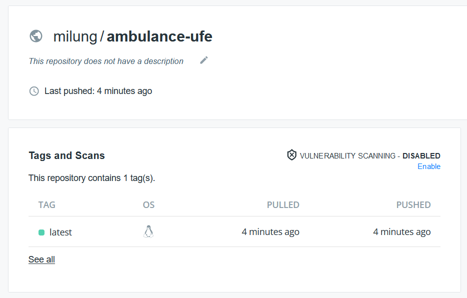

## Application Containerization

---

>info:>
Template for a pre-built container ([Details here](../99.Problems-Resolutions/01.development-containers.md)):
`registry-1.docker.io/milung/wac-ufe-041`

---

A [software container][containers] can be imagined as an image of a virtual device that brings with it all the libraries and dependencies needed to run a program without affecting or being affected by the specific requirements of other subsystems present on the same physical device. Unlike virtual machine technology, individual containers share the operating system kernel, making them less demanding on administration and the availability of physical resources.

In this exercise, we will use the [Docker][docker-containers] platform for software containers. The prerequisite is to have the [Docker Desktop][docker-desktop] system installed on Windows and Mac or the Docker package on Linux.

>info:> Docker Desktop has been paid for commercial use since January 2022. The price is acceptable for most commercial uses. If you are looking for a free alternative, you can use [Rancher Desktop][rancher-desktop].

Software containers are created from their images, which are a binary representation of the state of the operating system needed to run a specific program. An image - _image_ - can be created in various ways. The most common way is to create an image by compiling a file called `Dockerfile`. In this section, we will show you how to create such an image.

1. In the directory `${WAC_ROOT}/ambulance-ufe`, create a folder `${WAC_ROOT}/ambulance-ufe/build/docker`, and in it, create a file named [`Dockerfile`](https://docs.docker.com/engine/reference/builder/) with the following content:

```dockerfile
### compilation stage
FROM node:latest AS build

RUN mkdir /build
WORKDIR /build

COPY package.json .
RUN npm install 

COPY . .
RUN npm run build

### prepare go embedding of SPA server 
FROM milung/spa-server as spa-build 

COPY --from=build /build/www public
RUN ./build.sh

### scratch image - no additional dependencies only server process
FROM scratch
ENV CSP_HEADER=false

COPY --from=spa-build /app/server /server
CMD ["/server"]
EXPOSE 8080
```

This Dockerfile uses the so-called multi-stage image building. Each stage begins with the `FROM <base-image>` command. The container image is composed of layers of the file system, where each new layer modifies the content of the previous layer visible from the perspective of the running program in the so-called runtime layer of the active container. All previous layers must be available, which implies that deleting a file in a new layer does not reduce the final size of the image, only changes the visibility of files. From a practical perspective, each command in the `Dockerfile` - e.g., `COPY` or `RUN` - can be considered as creating a new layer.

In our case, we need the [Node.js][nodejs] system only during compilation to create files provided by the web server. The actual program will be executed by the web browser on the end user's device. For this reason, the first stage - identified by the `FROM node:latest AS build` command - is a so-called temporary image, separated from the second stage.

The second stage - starting with the `FROM milung/spa-server` command - represents another step in creating the image. In this step, static files are copied to the `public` directory in the working directory of the `milung/spa-server` container, and the `build.sh` command compiles the prepared program created in the [Golang][go] language. The purpose of this step is to minimize the resulting size of the target image and the number of its dependencies. More information about this image can be found in the [SirCremefresh/spa-server](https://github.com/SirCremefresh/spa-server) repository. _(The `milung/spa-server` image is just a multi-platform version of this image, which is also available for ARM64 architecture processors.)_

The final image is based on the so-called _scratch_ layer, which is essentially an empty layer of the container. Therefore, it no longer contains any additional dependencies but only communicates with the layer of the host computer. In this layer, we then copy our resulting process, which implements an HTTP service adapted for _Single Page Application_ functionality. In this step, we also used the definition of the environment variable `CSP_HEADER`, which is implicitly set to the value `false`. Such environment variables are visible in processes running in the container (not during the container creation), and their current value can be modified when creating an instance of the respective container from a pre-created image.

Theoretically, it would be possible to use only a single stage of image creation, for example, by adding the `CMD npm run start` command in the first stage. However, an image created in this way would be unnecessarily large - it would contain the entire [Node.js][nodejs] subsystem as well as all dependencies of our application in the `_node_modules` directory. Multiple stages of creating the final image and compiling the program directly during its creation ensure the portability and reproducibility of the entire process.

Also, note that in the first compilation step, we copy only the `package.json` file and execute the `npm install` command, which installs all the packages needed to run our application. The Docker system, when creating individual layers, compares the hash code of copied files (layers after applying the `COPY` command), and if there has been no change in content, it skips creating the next layer with the `RUN` command. Since changes to the `package.json` file are rare compared to the frequency of changes to the source files of our application, the package installation after the initial layer creation is reused, shortening the image compilation time for repeated runs. In essence, we try to order commands in the `Dockerfile` in such a way that artifacts with higher change frequency are processed later during compilation.

2. Create a new file `${WAC_ROOT}/ambulance-ufe/.dockerignore` with the content


```plain
dist
www
loader
node_modules
```

During the compilation of the `Dockerfile`, the content of the current directory (the _context_ directory) is recursively copied into the cache. The `.dockerignore` file allows specifying which files or directories are not needed for compilation, which significantly shortens the initialization time of the compilation, especially in the case of the `node_modules` directory.

3. Commit and synchronize the changes with the remote repository.


```ps
git add .
git commit -m 'dockerfile for ambulance waiting list web component'
git push
```

4. Compile the `Dockerfile` into a new image named `ambulance-ufe` using the following command:

```ps
docker build -t ambulance-ufe -f build/docker/Dockerfile .
```

>$apple:> In case you have an arm64 architecture processor and the docker image build fails with the message: `The chromium binary is not available for arm64.`, you need to add the line `ENV PUPPETEER_SKIP_CHROMIUM_DOWNLOAD true` before the line in the Dockerfile: `COPY package.json .`.

The package installation may take some time during the first execution of this command and depends on the speed of the network connection, but in subsequent compilations, the creation of this layer will be skipped unless the `package.json` file changes. After successfully running the command, you can start the container with the following command:

```ps
docker run -p 8000:8080 --name ambulance-ufe-server ambulance-ufe
```

and navigate to the web browser at [http://localhost:8000](http://localhost:8000), where you should see the list of waiting patients.

>info:> The option `-p 8000:8080` specifies that port `8000` on the host computer - `localhost` will be redirected to port `8080` of the virtual network interface of the running container. Port `8000` might already be in use by another program in some cases. If so, adjust the port number accordingly and navigate to the page with the corresponding port.

You can stop and remove the container using the command:

```ps
docker rm -f ambulance-ufe-server
```

5. If you are not registered on the [Docker Hub][docker-hub] website, go there and sign up. Take note of your assigned username. In the following commands, replace the placeholder `<your-account>` with your actual username.

6. Tag the container image with a new name that includes your Docker Hub username and publish it using the following commands:

```ps
docker tag ambulance-ufe <your-account>/ambulance-ufe:latest
docker login
docker push <your-account>/ambulance-ufe:latest
```

>info:> The name after the colon typically indicates the version of the container image. If not specified, it is automatically completed with the name `latest`. In the previous command, including the version explicitly and implicitly with `latest` is not necessary.

After completing these commands, on the [Docker Hub][docker-hub] website, you should see your new software container image.



>info:> If you encounter issues publishing the container image, check if you have successfully logged in to the [Docker Hub][docker-hub] and if you used the correct username.