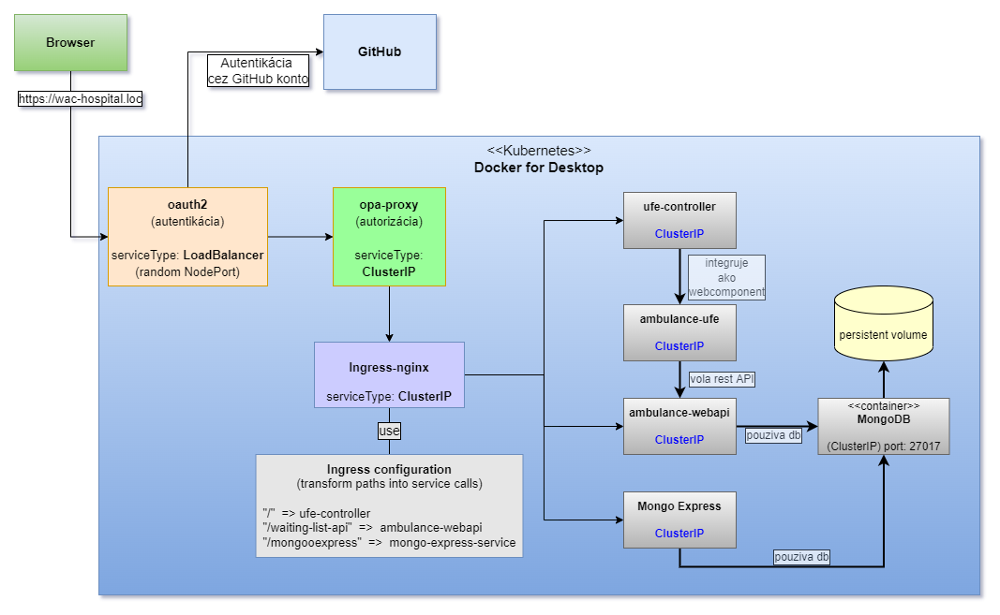

# Integration of Microservices into Service Mesh

Our system consists of individual microservices that collaborate in a declarative manner within the Kubernetes system. However, from an external perspective, they appear as a set of different services deployed in different subdomains, connected only by ad-hoc configuration. In this part of the exercise, we will integrate these microservices into a single assembly and add additional layers of coordination to help create a more cohesive structure for our system.

In this chapter, by the term "Service Mesh," we mean a set of tools and techniques that help us create a comprehensive system from multiple microservices. We will also demonstrate the deployment of services that implement these techniques and are also known in the community as "Service Mesh" tools - for example, [Istio](https://istio.io/), [Linkerd], and others. In our case, we will use [Linkerd] later in the chapter.

_The image illustrates the desired state._

