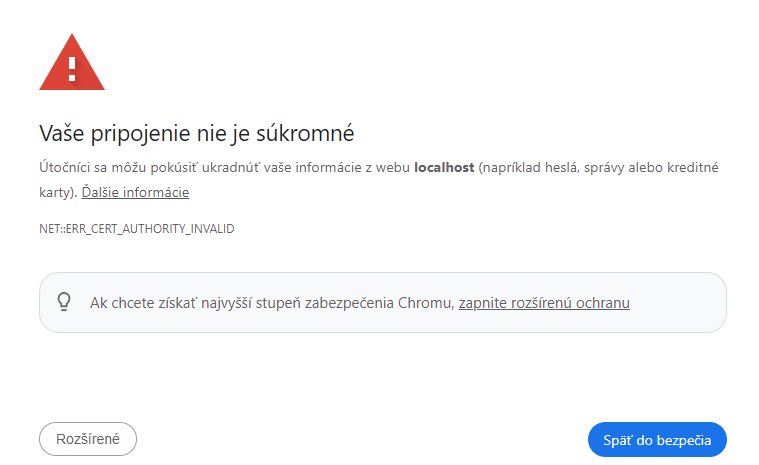

# Secure Connection to the Application via HTTPS

---

```ps
devcontainer templates apply -t registry-1.docker.io/milung/wac-mesh-040
```

---

Our application is now available on port 80 (HTTP) and appears as a single application server. However, the [HTTP protocol] itself transfers all data in plain text and in an insecure format, which can lead to information leakage on public networks. Additionally, anyone can access our application, which may not always be desirable; for example, we might want to restrict access to the mongo express instance or allow access only for registered patients. In this section, we will demonstrate how to secure access to our application using [TLS](https://developer.mozilla.org/en-US/docs/Web/Security/Transport_Layer_Security). In the next section, we will address request authentication and authorization.

To establish a secure connection to our application, we need to create a TLS certificate using a PKI infrastructure and deploy it into our Kubernetes cluster. For a certificate to be accepted by the client, it must be issued or verified by a recognized certification authority that the client trusts. Browsers have pre-configured certification authorities that they trust and can use to verify the validity of a certificate, or we can add our own certification authorities.

For public servers, we can use some publicly available certification authorities that issue certificates for free, such as [Let's Encrypt](https://letsencrypt.org/). However, using it requires a public domain, which we don't have for this exercise. Therefore, for local development, we will use a so-called [_self-signed certificate_](https://en.wikipedia.org/wiki/Self-signed_certificate), and we will instruct the browser to trust it. However, using a _self-signed certificate_ for public servers is risky because the client cannot verify the certificate's validity. Therefore, we will also set up infrastructure to use the [Let's Encrypt](https://letsencrypt.org/) service.

To issue certificates, we will deploy the [cert-manager] service into the cluster. Cert-manager supports several custom objects; in our case, we will mainly use objects of type [_Issuer_](https://cert-manager.io/docs/concepts/issuer/) and indirectly objects of type [_Certificate_](https://cert-manager.io/docs/concepts/certificate/). The latter will be created by _cert-manager_ based on annotations placed on our [_Gateway_](https://cert-manager.io/docs/usage/gateway/) object.

1. Create a folder `${WAC_ROOT}/ambulance-gitops/infrastructure/cert-manager` and within it, create a file `${WAC_ROOT}/ambulance-gitops/infrastructure/cert-manager/development.issuer.yaml` with the following content:

```yaml
apiVersion: cert-manager.io/v1
kind: Issuer
metadata:
  name: development-issuer
  namespace: wac-hospital
spec:
  selfSigned: {} @_important_@
```

By doing this, we have created an authority that will issue certificates for our local development environment. Such certificates are generally unsafe because the client cannot verify their validity. However, for a local development environment, this is sufficient.

>info:> If you want to create your own authority for issuing certificates, for example, for a development cluster or a specific department, you can refer to this simple [guide](https://cert-manager.io/docs/configuration/selfsigned/#bootstrapping-ca-issuers).

2. Next, create a file `${WAC_ROOT}/ambulance-gitops/infrastructure/cert-manager/lets-encrypt.issuer.yaml`.

```yaml
apiVersion: cert-manager.io/v1
kind: Issuer
metadata:
  name: letsencrypt-issuer
  namespace: default
spec:
  acme:
    email: <your-email>
    server: https://acme-staging-v02.api.letsencrypt.org/directory  # Use this for testing
    privateKeySecretRef:
      name: letsencrypt-issuer-account-key
    solvers:
      - http01:
          gatewayHTTPRoute:
            parentRefs:
              - name: wac-hospital-gateway
                namespace: wac-hospital
                kind: Gateway
```

In this exercise, we won't use this certificate issuer; it serves mainly as an example for your future use. If you decide to use this certificate issuer, you need to replace the email address with your own. Also, it's necessary to change `server` to `https://acme-v02.api.letsencrypt.org/directory` for a production environment. The variable `privateKeySecretRef` specifies the name of the automatically generated _Secret_ that _cert-manager_ will create. For more information, refer to the [documentation](https://cert-manager.io/docs/configuration/acme/).

3. Now, create a file `${WAC_ROOT}/ambulance-gitops/infrastructure/cert-manager/kustomization.yaml`.

```yaml
apiVersion: kustomize.config.k8s.io/v1beta1
kind: Kustomization

resources:
# check the version is up-to-date
- https://github.com/cert-manager/cert-manager/releases/download/v1.13.1/cert-manager.yaml
- development.issuer.yaml
- lets-encrypt.issuer.yaml

patches:
- patch: |-
  - op: add
    path: /spec/template/spec/containers/0/args/-
    value: --feature-gates=ExperimentalGatewayAPISupport=true @_important_@
  target:
    kind: Deployment
    name: cert-manager
    namespace: cert-manager
```

In this file, we've created configuration for _cert-manager_ and added two objects of type _Issuers_. Additionally, we've included a patch that enables experimental support for the [_Gateway API_][gatewayapi].

4. Let's add _cert-manager_ to our cluster. Modify the file `${WAC_ROOT}/ambulance-gitops/clusters/localhost/prepare/kustomization.yaml`:

```yaml
... 
resources:
...
- ../../../infrastructure/cert-manager @_add_@
  
patches: 
...
```

5. Modify the configuration for the `wac-hospital-gateway` object. Edit the file `${WAC_ROOT}/ambulance-gitops/infrastructure/envoy-gateway/gateway.yaml`:

```yaml
  ...
  metadata:
    name: wac-hospital-gateway
    namespace: wac-hospital
    annotations:
      cert-manager.io/issuer: development-issuer # patch this to letsencrypt-issuer for production cluster   @_add_@
      cert-manager.io/email-sans: "pfx@gmail.com"   @_add_@
      cert-manager.io/subject-organizations: "WAC-Hospital"   @_add_@
      cert-manager.io/subject-organizationalunits: "IT Support"   @_add_@
      cert-manager.io/subject-countries: "SK"   @_add_@
      cert-manager.io/subject-localities: "Bratislava"   @_add_@
      cert-manager.io/revision-history-limit: "3"   @_add_@
      cert-manager.io/private-key-rotation-policy: Always   @_add_@
  spec:
    gatewayClassName: wac-hospital-gateway-class
    listeners:
    - name: http
      ...
    - hostname: wac-hospital.loc     @_add_@
      name: fqdn     @_add_@
      protocol: HTTPS     @_add_@
      port: 443     @_add_@
      tls:     @_add_@
        mode: Terminate     @_add_@
        certificateRefs:     @_add_@
        - kind: Secret     @_add_@
          name: wac-hospital-tls     @_add_@
    - hostname: localhost     @_add_@
      name: https-localhost     @_add_@
      protocol: HTTPS     @_add_@
      port: 443     @_add_@
      tls:     @_add_@
        mode: Terminate     @_add_@
        certificateRefs:     @_add_@
        - kind: Secret     @_add_@
          name: wac-hospital-tls     @_add_@
```

Using a block of annotations, we inform _cert-manager_ to create a certificate for the domain `wac-hospital.loc` and for the domain `localhost`. In the case of a production cluster, we would need to change the certificate issuer to `letsencrypt-issuer` and modify the email address, as well as change the domain to a publicly accessible one. We will use the domain `wac-hospital.loc` in the next section, where it will be required for proper communication with the [OpenID] provider.

6. Verify the correctness of the configuration with the command in the directory `${WAC_ROOT}/ambulance-gitops`.

```ps
kubectl kustomize clusters/localhost/prepare
```

and then archive and submit the code to the remote repository.

```ps
git add .
git commit -m "Added cert-manager and TLS listener"
git push
```

Verify that our changes were successfully deployed with the command

```ps
kubectl get kustomization -n wac-hospital
```

7. In the browser, open the page [https://localhost/ui/](https://localhost/ui/). The browser will alert you about an invalid certificate because it is a self-signed certificate:



Click the _Advanced_ button, and then click the link to _Proceed to https://localhost/ui/_. You should see the application page, with the browser still warning you about the insecure connection in the address bar.

>info:> The current process for proceeding to a page with an unsafe certificate may vary between browsers.
